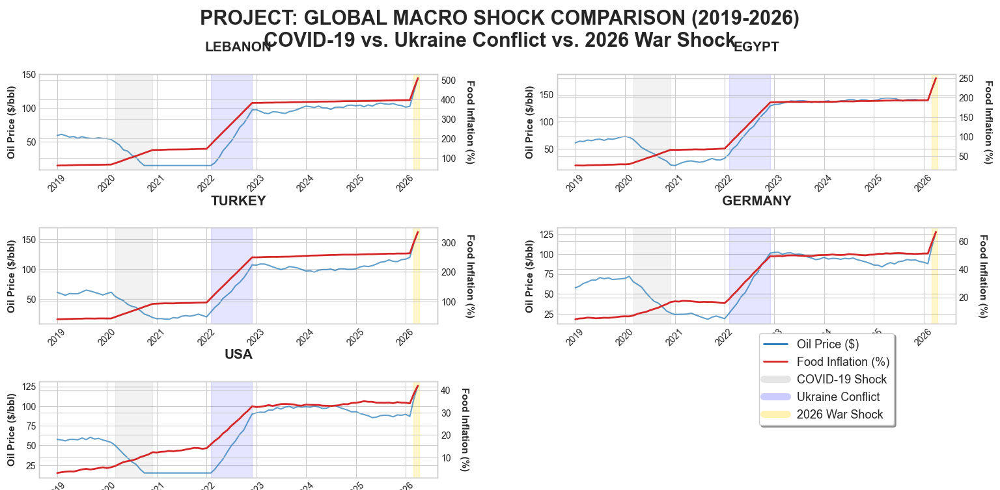

# 🛢️ When Oil Spikes, Plates Shrink: Global Macro Shock Comparison (2019-2026)

**An Applied Economics and Data Analysis project measuring the impact of geopolitical energy shocks on national food inflation.**

## 📌 Executive Summary
How do sudden, global increases in crude oil prices affect local purchasing power? This project simulates and analyzes the correlation between global Brent Crude spikes and domestic food inflation across five distinct economies. 

By modeling three major historical supply chain crises—the 2020 COVID-19 pandemic, the 2022 Ukraine Conflict, and the 2026 Middle East Escalation—this analysis highlights the stark contrast in economic resilience between import-dependent nations and diversified economies.

## 📊 The Data Story & Key Insights
The visualization below tracks the dual-axis relationship between oil prices and food inflation over a 7-year period.

* **Vulnerability in Import-Dependent Economies:** Countries like Lebanon and Turkey exhibit extreme sensitivity to global oil shocks. The data demonstrates a rapid transmission of energy costs into local food CPI, highlighting structural vulnerabilities and currency dynamics.
* **Resilience in Diversified Economies:** The USA and Germany demonstrate significant buffering capacity. Despite absorbing the identical $100+/bbl oil spikes in 2022 and 2026, their domestic food inflation remains relatively flat, protected by strategic reserves and domestic production capabilities.
* **The "Triple-Shock" Compounding Effect:** The 2026 geopolitical escalation reveals that economies which haven't fully recovered from the 2020 and 2022 supply chain crises experience a steeper, more aggressive inflationary spike.

## 🛠️ Technical Stack & Methodology
This end-to-end analytical pipeline was built using:
* **Python (Pandas, NumPy):** Developed an ETL pipeline to generate a synthetic, statistically weighted macroeconomic dataset mimicking real-world volatility.
* **Statistical Modeling:** Applied targeted sensitivity variables (`sens`) to replicate national import-dependency ratios and baseline inflation metrics.
* **SQL (SQLite):** Engineered a relational database (`analytical_master`) for secure data storage and seamless downstream ingestion.
* **Data Visualization (Matplotlib):** Designed a boardroom-ready, 5-panel comparative grid with safe-spacing layout adjustments for clear stakeholder presentation.

## 📁 Repository Contents
* `scripts/triple_shock_pipeline.py`: The core Python script containing the data generation, statistical modeling, and visualization logic.
* `data/macro_project.db`: The SQLite relational database storing the normalized output.
* `visuals/global_macro_shocks.png`: The exported comparative analysis graph.

---
*Created as a portfolio piece demonstrating end-to-end data engineering, statistical modeling, and macroeconomic storytelling.*
